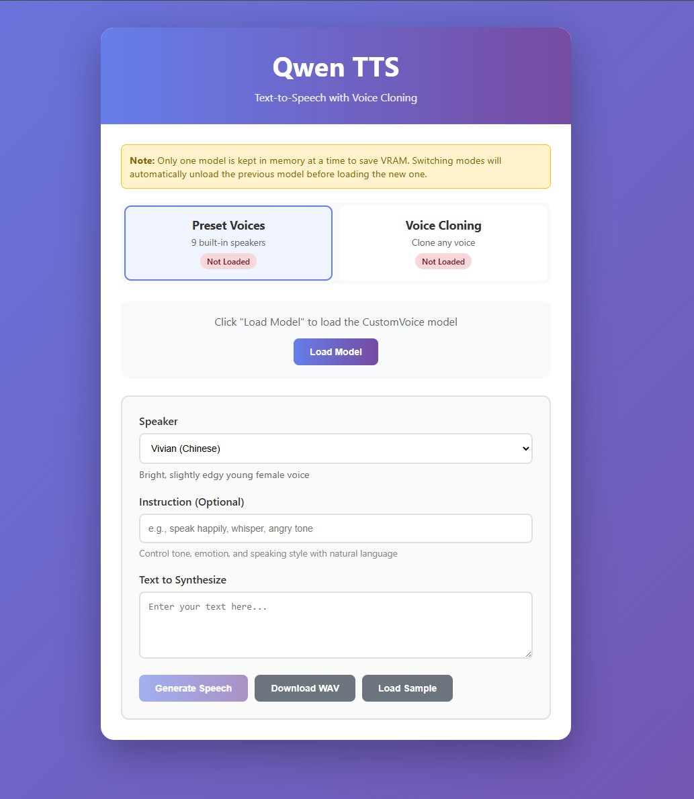
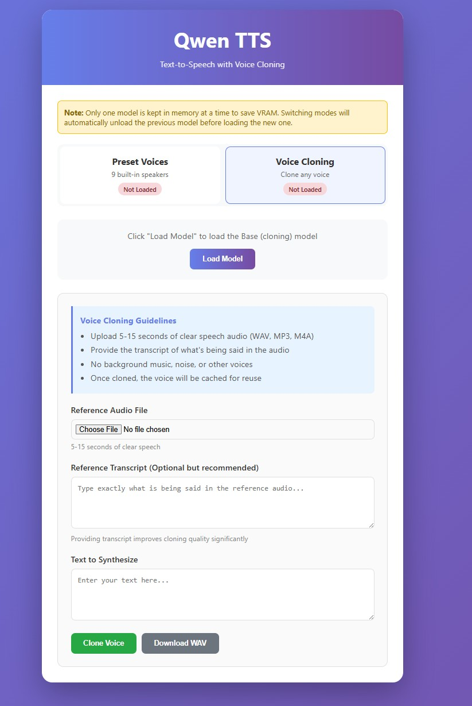

# Qwen-TTS Basic WebUI

A clean, user-friendly web interface for the [Qwen3-TTS-12Hz-1.7B-CustomVoice](https://huggingface.co/Qwen/Qwen3-TTS-12Hz-1.7B-CustomVoice) and [Qwen3-TTS-12Hz-1.7B-Base](https://huggingface.co/Qwen/Qwen3-TTS-12Hz-1.7B-Base) text-to-speech models.

## Screenshots

### Preset Voices Mode


### Voice Cloning Mode


## Features

- **Modern Web Interface** - Clean, responsive design with gradient styling
- **9 Premium Preset Voices** - Choose from multiple speakers with different languages, genders, and styles
- **Voice Cloning** - Clone any voice from just 5-15 seconds of audio
- **Single Model Loading** - Only one model loaded at a time to save VRAM (works with 8GB GPUs)
- **GPU Support** - Supports both NVIDIA (CUDA) and AMD (ROCm) GPUs, with automatic CPU fallback
- **Style Control** - Use natural language instructions to control tone, emotion, and prosody (preset voices)
- **Multi-language Support** - 10 languages: Chinese, English, Japanese, Korean, German, French, Russian, Portuguese, Spanish, Italian
- **In-Browser Playback** - Listen to generated speech directly in the browser
- **WAV Export** - Download generated audio as WAV files
- **Voice Caching** - Reuse cloned voices without re-uploading reference audio

## Quick Start

### Prerequisites

- Python 3.10+
- CUDA-capable GPU (recommended, 8GB+ VRAM) or CPU
- For AMD GPUs: ROCm-supported GPU (RX 6000 series or newer, Linux only)

### Installation

1. Clone this repository:
```bash
git clone https://github.com/seeker789/Qwen-TTS-basic-webui.git
cd Qwen-TTS-basic-webui
```

2. Create a virtual environment:
```bash
conda create -n qwen-tts python=3.12 -y
conda activate qwen-tts
```

3. Install dependencies:
```bash
pip install -r requirements.txt
```

**For NVIDIA GPUs:** PyTorch with CUDA should be installed automatically.

**For AMD GPUs (ROCm):**
```bash
pip uninstall torch torchvision torchaudio
pip install torch torchvision torchaudio --index-url https://download.pytorch.org/whl/rocm6.2
```

Optional: Install FlashAttention 2 for reduced GPU memory usage:
```bash
pip install flash-attn --no-build-isolation
```

### Usage

1. Start the web server:
```bash
python web_app.py
```

2. Open your browser and navigate to:
```
http://localhost:5000
```

3. **Select Mode** - Click on either "Preset Voices" or "Voice Cloning" card at the top

4. **Load Model** - Click "Load Model" button:
   - Preset Voices loads the CustomVoice model (~3.5GB)
   - Voice Cloning loads the Base model (~3.5GB)
   - Previous model is automatically unloaded to save VRAM

5. **Generate Speech**:
   - **Preset Voices**: Select a speaker, add optional style instructions, enter text, click "Generate"
   - **Voice Cloning**: Upload reference audio (5-15 sec), add transcript, enter text, click "Clone Voice"

## Voice Cloning

### Requirements for Reference Audio

| Parameter | Recommendation |
|-----------|----------------|
| **Duration** | 5-15 seconds (minimum 3 seconds) |
| **Format** | WAV, MP3, M4A, OGG |
| **Quality** | Clear speech, no background noise/music |
| **Content** | Single speaker, continuous speech |
| **Transcript** | Exact text spoken (improves quality significantly) |

### Voice Cloning Tips

- Use high-quality, noise-free recordings for best results
- The transcript should match the audio exactly
- Once cloned, the voice is cached and can be reused without re-uploading
- You can clone voices in any of the 10 supported languages

## Available Preset Speakers

| Speaker | Description | Language |
|---------|-------------|----------|
| Vivian | Bright, slightly edgy young female voice | Chinese |
| Serena | Warm, gentle young female voice | Chinese |
| Uncle_Fu | Seasoned male voice with low, mellow timbre | Chinese |
| Dylan | Youthful Beijing male voice | Chinese (Beijing Dialect) |
| Eric | Lively Chengdu male voice | Chinese (Sichuan Dialect) |
| Ryan | Dynamic male voice with strong rhythmic drive | English |
| Aiden | Sunny American male voice with clear midrange | English |
| Ono_Anna | Playful Japanese female voice | Japanese |
| Sohee | Warm Korean female voice with rich emotion | Korean |

## Style Control Examples (Preset Voices)

Use natural language instructions to control the voice:

- **Emotion**: "speak happily", "sound sad", "angry tone", "excited"
- **Style**: "whisper", "shout", "sing", "narrate"
- **Speed**: "speak slowly", "speak quickly"
- **Combined**: "whisper sadly", "speak excitedly and quickly", "calm and gentle"

## Hardware Requirements

| Component | Minimum | Recommended |
|-----------|---------|-------------|
| GPU | CPU only | NVIDIA GPU with 8GB+ VRAM |
| AMD GPU | Not supported* | RX 6600 XT+ (ROCm, Linux only) |
| RAM | 8GB | 16GB+ |
| Storage | 5GB free | 10GB free |
| Network | - | Broadband (for model download) |

**Note on AMD GPUs:** Only one model (~3.5GB) is kept in memory at a time, making it possible to run on 8GB VRAM GPUs.

*AMD RX 5000 series (including 5700 XT) are not supported by ROCm and will use CPU.

## GPU Support Details

### NVIDIA GPUs (CUDA)
- Full support with best performance
- GTX 1060 6GB or newer recommended
- Automatic GPU detection and memory management

### AMD GPUs (ROCm)
- Limited support - requires Linux
- RX 6000 series (RDNA2) or newer
- Install PyTorch with ROCm: `pip install torch --index-url https://download.pytorch.org/whl/rocm6.2`
- RX 5000 series and older use CPU fallback

### CPU Fallback
- Works on any system without GPU
- Slower generation (5-10x slower than GPU)
- No VRAM limitations

## Model Cache Location

Models are downloaded and cached by HuggingFace:

- **Windows**: `C:\Users\<username>\.cache\huggingface\hub`
- **Linux/macOS**: `~/.cache/huggingface/hub`

To change the cache location, set the `HF_HOME` environment variable before running.

## Alternative: Desktop GUI

This repository also includes a desktop GUI version built with tkinter (preset voices only):

```bash
python qwen_tts_gui.py
```

## Troubleshooting

### Model fails to load
- Ensure you have enough disk space (~3.5GB per model)
- Check GPU memory availability (8GB+ recommended)
- The model will automatically fall back to CPU if GPU is unavailable

### Voice cloning quality is poor
- Use clearer audio with less background noise
- Ensure the reference transcript matches the audio exactly
- Try using longer audio samples (10-15 seconds)

### Slow generation on CPU
- This is expected - CPU is 5-10x slower than GPU
- Consider upgrading to an NVIDIA GPU for best performance

### GPU not detected
- **NVIDIA**: Install latest drivers and CUDA toolkit
- **AMD**: Ensure you have ROCm-installed PyTorch (Linux only)
- Check console output at startup for GPU detection info

## Project Structure

```
Qwen-TTS-basic-webui/
├── web_app.py                  # Flask web application (preset + cloning)
├── qwen_tts_gui.py             # Desktop GUI (preset voices only)
├── templates/
│   └── index.html              # Web interface template
├── requirements.txt            # Python dependencies
├── qwenTTSpresetvoices.jpg     # Screenshot: Preset Voices mode
├── qwenTTSvoicecloning.jpg     # Screenshot: Voice Cloning mode
└── README.md                   # This file
```

## Dependencies

- [qwen-tts](https://pypi.org/project/qwen-tts/) - Qwen TTS model package
- [torch](https://pytorch.org/) - PyTorch deep learning framework
- [soundfile](https://pysoundfile.readthedocs.io/) - Audio file I/O
- [flask](https://flask.palletsprojects.com/) - Web framework
- [pygame](https://www.pygame.org/) - Audio playback (desktop GUI)

## Acknowledgments

This project uses the Qwen3-TTS models from Alibaba Cloud's Qwen series:
- [Qwen3-TTS-12Hz-1.7B-CustomVoice](https://huggingface.co/Qwen/Qwen3-TTS-12Hz-1.7B-CustomVoice) - Preset voices
- [Qwen3-TTS-12Hz-1.7B-Base](https://huggingface.co/Qwen/Qwen3-TTS-12Hz-1.7B-Base) - Voice cloning

## Sources

- [Qwen3-TTS Voice Cloning API Reference](https://www.alibabacloud.com/help/en/model-studio/qwen-tts-voice-cloning)
- [Qwen3-TTS GitHub Repository](https://github.com/QwenLM/Qwen3-TTS)
- [Qwen3-TTS: 3-Second Voice Cloning Beats ElevenLabs](https://byteiota.com/qwen3-tts-3-second-voice-cloning-beats-elevenlabs/)

## License

This interface code is provided as-is. Please refer to the [Qwen3-TTS model license](https://huggingface.co/Qwen/Qwen3-TTS-12Hz-1.7B-CustomVoice) for terms regarding the use of the underlying TTS model.
