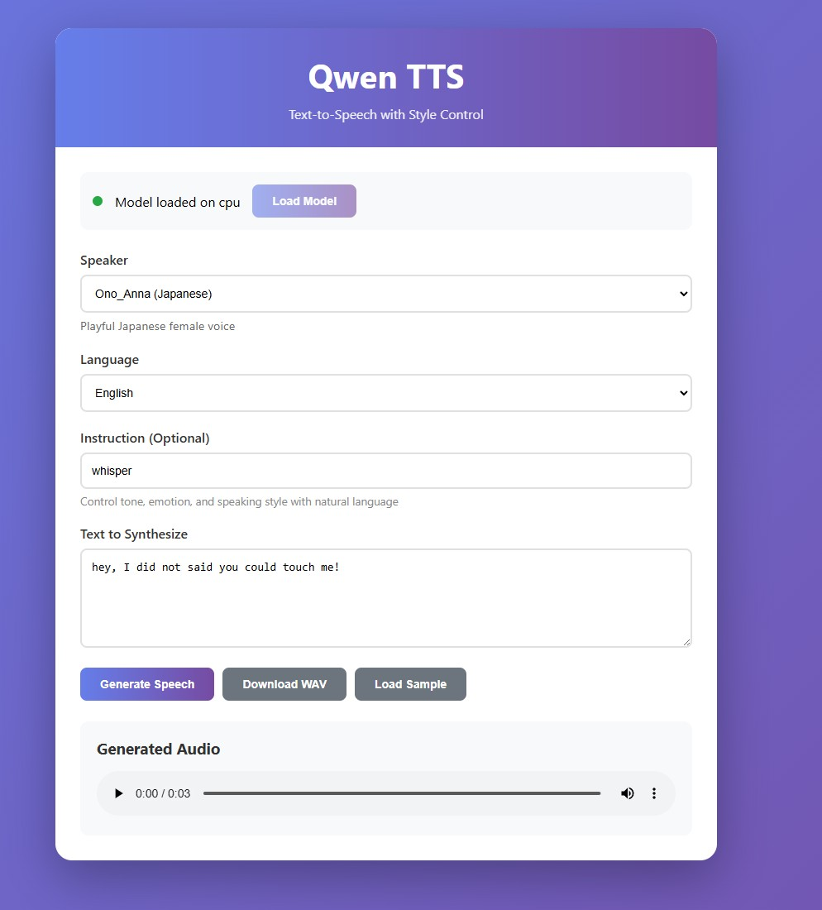

# Qwen-TTS Basic WebUI

A clean, user-friendly web interface for the [Qwen3-TTS-12Hz-1.7B-CustomVoice](https://huggingface.co/Qwen/Qwen3-TTS-12Hz-1.7B-CustomVoice) text-to-speech model.



## Features

- **Modern Web Interface** - Clean, responsive design with gradient styling
- **9 Premium Voices** - Choose from multiple speakers with different languages, genders, and styles
- **Style Control** - Use natural language instructions to control tone, emotion, and prosody
- **Multi-language Support** - 10 languages: Chinese, English, Japanese, Korean, German, French, Russian, Portuguese, Spanish, Italian
- **In-Browser Playback** - Listen to generated speech directly in the browser
- **WAV Export** - Download generated audio as WAV files
- **Sample Text Loader** - Quick load sample texts for each speaker

## Quick Start

### Prerequisites

- Python 3.10+
- CUDA-capable GPU (recommended, 8GB+ VRAM) or CPU

### Installation

1. Clone this repository:
```bash
git clone https://github.com/yourusername/Qwen-TTS-basic-webui.git
cd Qwen-TTS-basic-webui
```

2. Create a virtual environment:
```bash
conda create -n qwen-tts python=3.12 -y
conda activate qwen-tts
```

3. Install dependencies:
```bash
pip install -r requirements.txt
```

Optional: Install FlashAttention 2 for reduced GPU memory usage:
```bash
pip install flash-attn --no-build-isolation
```

### Usage

1. Start the web server:
```bash
python web_app.py
```

2. Open your browser and navigate to:
```
http://localhost:5000
```

3. Click **"Load Model"** to download and initialize the TTS model (~3.5GB on first run)

4. Configure your synthesis:
   - Select a **Speaker** from the dropdown
   - Choose the **Language** (or use "Auto" for auto-detection)
   - (Optional) Enter an **Instruction** to control style/tone
   - Enter your **text**

5. Click **"Generate Speech"** and listen to the result!

## Available Speakers

| Speaker | Description | Language |
|---------|-------------|----------|
| Vivian | Bright, slightly edgy young female voice | Chinese |
| Serena | Warm, gentle young female voice | Chinese |
| Uncle_Fu | Seasoned male voice with low, mellow timbre | Chinese |
| Dylan | Youthful Beijing male voice | Chinese (Beijing Dialect) |
| Eric | Lively Chengdu male voice | Chinese (Sichuan Dialect) |
| Ryan | Dynamic male voice with strong rhythmic drive | English |
| Aiden | Sunny American male voice with clear midrange | English |
| Ono_Anna | Playful Japanese female voice | Japanese |
| Sohee | Warm Korean female voice with rich emotion | Korean |

## Style Control Examples

Use natural language instructions to control the voice:

- **Emotion**: "speak happily", "sound sad", "angry tone", "excited"
- **Style**: "whisper", "shout", "sing", "narrate"
- **Speed**: "speak slowly", "speak quickly"
- **Combined**: "whisper sadly", "speak excitedly and quickly", "calm and gentle"

## Alternative: Desktop GUI

This repository also includes a desktop GUI version built with tkinter:

```bash
python qwen_tts_gui.py
```

Choose either the web interface or desktop GUI based on your preference.

## Hardware Requirements

| Component | Minimum | Recommended |
|-----------|---------|-------------|
| GPU | CPU only | NVIDIA GPU with 8GB+ VRAM |
| RAM | 8GB | 16GB+ |
| Storage | 5GB free | 10GB free |
| Network | - | Broadband (for model download) |

## Model Cache Location

The model is downloaded and cached by HuggingFace:

- **Windows**: `C:\Users\<username>\.cache\huggingface\hub`
- **Linux/macOS**: `~/.cache/huggingface/hub`

To change the cache location, set the `HF_HOME` environment variable before running.

## Troubleshooting

### Model fails to load
- Ensure you have enough disk space (~3.5GB for model)
- Check GPU memory availability
- The model will automatically fall back to CPU if CUDA is unavailable

### Slow generation
- Use a GPU for significantly faster inference
- Close other memory-intensive applications
- Consider installing FlashAttention 2

### Web interface not accessible
- Check that port 5000 is not in use by another application
- To allow external access, modify `web_app.py` and change `host="0.0.0.0"`

## Project Structure

```
Qwen-TTS-basic-webui/
├── web_app.py              # Flask web application
├── qwen_tts_gui.py         # Alternative desktop GUI (tkinter)
├── templates/
│   └── index.html          # Web interface template
├── requirements.txt        # Python dependencies
├── qwenttsscreenshot.jpg   # Screenshot of the web UI
└── README.md              # This file
```

## Dependencies

- [qwen-tts](https://pypi.org/project/qwen-tts/) - Qwen TTS model package
- [torch](https://pytorch.org/) - PyTorch deep learning framework
- [soundfile](https://pysoundfile.readthedocs.io/) - Audio file I/O
- [flask](https://flask.palletsprojects.com/) - Web framework
- [pygame](https://www.pygame.org/) - Audio playback (desktop GUI)

## Acknowledgments

This project uses the [Qwen3-TTS-12Hz-1.7B-CustomVoice](https://huggingface.co/Qwen/Qwen3-TTS-12Hz-1.7B-CustomVoice) model from Alibaba Cloud's Qwen series.

## License

This interface code is provided as-is. Please refer to the [Qwen3-TTS model license](https://huggingface.co/Qwen/Qwen3-TTS-12Hz-1.7B-CustomVoice) for terms regarding the use of the underlying TTS model.
